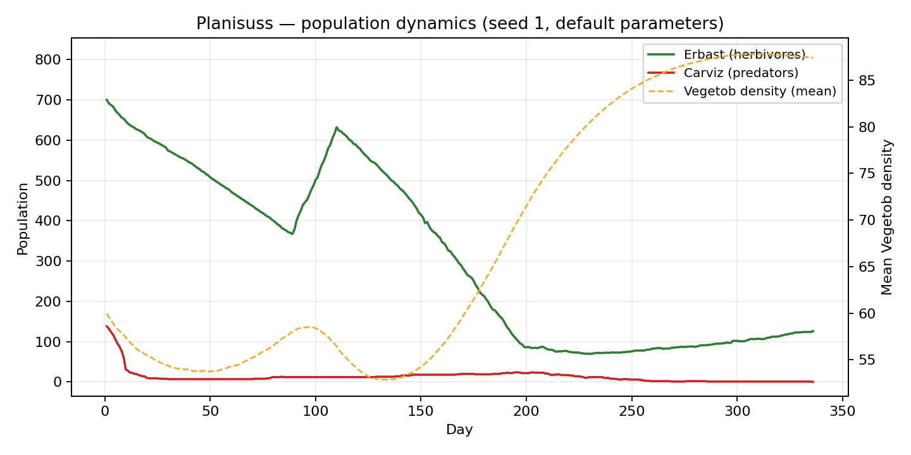
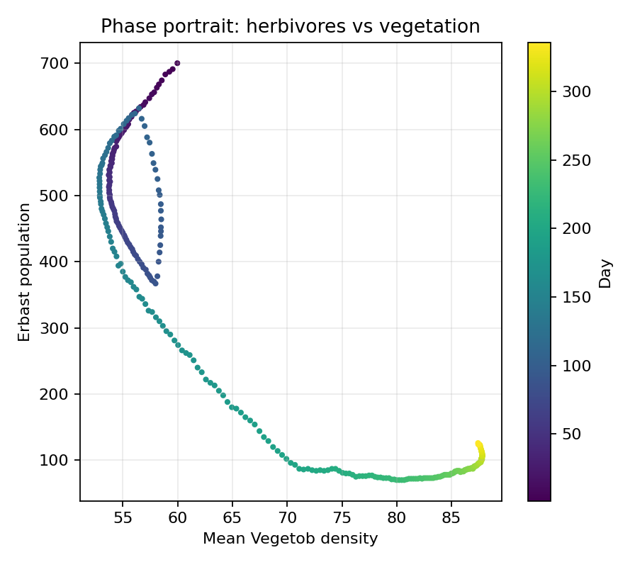

# Planisuss — agent-based ecosystem simulation

A three-species ecosystem simulated on a grid, written as an object-oriented Python
application: ~4,400 lines across 11 modules, with a real-time matplotlib interface,
a Tkinter configuration window, and save/load of the full simulation state.

Final project for *Computer Programming, Algorithms and Data Structures*,
BSc in Artificial Intelligence (Università di Pavia · Università di Milano-Bicocca ·
Università degli Studi di Milano), 2024/2025.



*Seed 1, default parameters: herbivores (green) and predators (red) on the left axis,
mean vegetation density (dashed) on the right.*

## The world

A grid of land and water cells. Water forms the border, so the world is closed and
animals cannot leave it. Every land cell holds **Vegetob**, a plant resource that
regrows each day at a rate proportional to the room left before saturation — fast when
grazed down, slow near the ceiling.

Two animal species live on the grid:

- **Erbast**, herbivores that graze on Vegetob and form **herds**
- **Carviz**, predators that hunt Erbast and form **prides**

Each individual carries its own energy, maximum lifetime, social attitude, and
species-specific traits: a preferred vegetation density for Erbast, a hunting
efficiency and success rate for Carviz. Every day each animal decides, from purely
local information about its neighbourhood, whether to move, feed, join a group, or
stay put. Offspring inherit traits by fixed rules — energy is split between the two
children, other properties average back to the parent's value.

Groups act collectively. A herd picks its destination by averaging the cell
preferences of all its members; a pride hunts with a shared coordination bonus
derived from its members' traits. Members whose social attitude or energy is too low
leave the group and act alone rather than follow it.

A day runs in five phases: **growth → movement → grazing and hunting → procreation →
global events**. Two global mechanisms keep the world from running away: *migrations*
repopulate a species that falls below a fraction of its expected size, and *epidemics*
cull one that grows past a multiple of its initial ratio.

## What the simulation shows

**Population cycles emerge without being coded anywhere in the rules.** Grazing
depletes the vegetation, the herbivore population starves down, and the vegetation
recovers while their numbers are low — which lets the herbivores climb again. The
coupling is visible in the figure above around days 90–110, and in the phase portrait
below as a loop rather than a straight line.



**The default parameters do not support a stable three-species system.** Running the
simulation with five random seeds shows the same failure every time: the predator
population peaks in the first days, collapses within roughly two weeks, lingers in
single digits, and never recovers. Extinction of the predators ends the run well
before the configured 1,000-day horizon.

| Seed | Carviz peak | Predators extinct on day | Erbast peak |
|-----:|------------:|-------------------------:|------------:|
| 1 | 138 | 336 | 700 |
| 2 | 143 | 265 | 898 |
| 3 | 137 | 293 | 686 |
| 4 | 143 | 249 | 813 |
| 5 | 134 | 266 | 1,072 |

With the predators gone, the remaining herbivores are too few to hold the vegetation
down: mean Vegetob density climbs toward saturation and the system settles into a
low-herbivore, high-vegetation state — the tail visible on the right of the phase
portrait. The parameter range that sustains all three species is narrower than the
defaults suggest.

Reproduce the table with:

```bash
python reproduce_figures.py --seeds 1 2 3 4 5 --summary-only
```

## Architecture

```
animal.py             base class: energy, ageing, movement, reproduction
erbast.py             herbivore: grazing, cell desirability
carviz.py             predator: hunting, prey selection, desirability
herd.py               Erbast group: collective grazing and movement
pride.py              Carviz group: coordinated hunting, inter-pride combat
cell.py               grid cell: terrain, occupants, Vegetob, daily regrouping
vegetob.py            vegetation growth and consumption
game_manager.py       daily cycle, world initialisation, save/load, statistics
user_interface.py     matplotlib visualisation and controls
main.py               Tkinter configuration window and entry point
constants.py          simulation parameters
reproduce_figures.py  head-less runs that generate the figures above
```

Built on inheritance (`Animal` → `Erbast`, `Carviz`) with full type hints,
`TYPE_CHECKING` imports to keep mutually-referencing classes free of circular
imports, docstrings throughout, explicit getters and setters, state serialisation via
`pickle`, history logging, and a configuration window that validates world parameters
before a run starts.

## Running it

Requires Python 3.12 with NumPy and matplotlib; Tkinter ships with most CPython
installations.

```bash
pip install -r requirements.txt
python main.py
```

The launcher offers a new simulation or a saved one. The configuration window exposes
world size, initial population ratios, water ratio, group capacities, and run length,
each validated against an allowed range. During the run the interface shows the grid,
per-species population counts and mean Vegetob density, with speed control and
save/load.

To run without a GUI — useful for parameter sweeps — drive `GameManager` directly:

```python
import random
from game_manager import GameManager

random.seed(1)
manager = GameManager()
manager.initialize_world()
while manager.simulate_one_day():
    pass
print(manager.history["Erbast"][-1], manager.history["Carviz"][-1])
```

## Repository layout

```
*.py         simulation modules
figures/     population dynamics, phase portrait
docs/        project report (design decisions, testing, limitations)
```

## Known limitations

- Movement heuristics are local and greedy: animals score neighbouring cells with a
  weighted desirability function and take the best one. There is no planning, no
  learning, and no memory beyond the last ten visited cells.
- Getters and setters do not validate input or return defensive copies. This is a
  deliberate trade-off for a closed system and would need revisiting before exposing
  the classes to untrusted callers.
- Very large grids combined with the highest initial herbivore ratio can grow the
  population fast enough to slow the simulation down noticeably after several hundred
  days.

`docs/Report.pdf` covers the design decisions, testing scenarios, and possible
extensions in detail.
