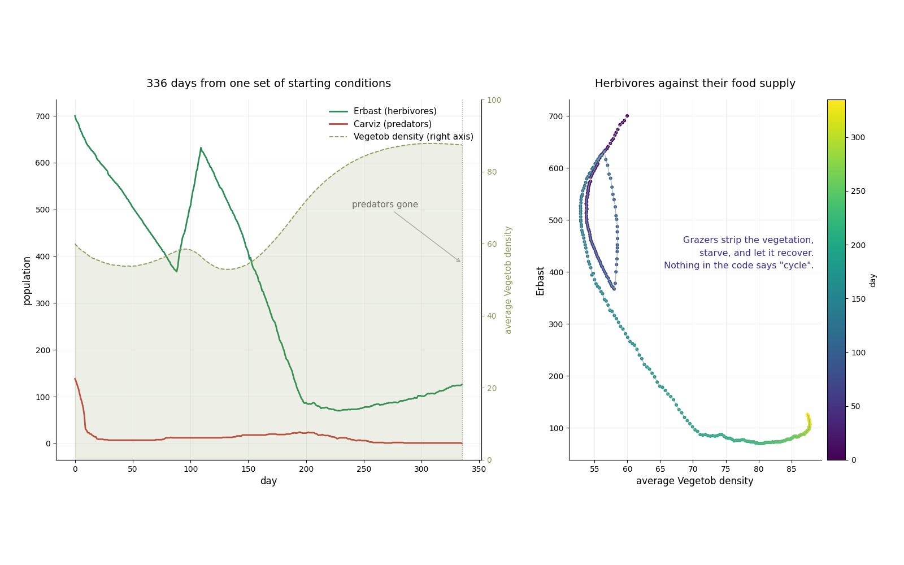

# Planisuss — agent-based ecosystem simulation

An agent-based simulation of a three-species ecosystem, written as an object-oriented
Python application of roughly 4,400 lines across 11 modules.

Programming project, BSc in Artificial Intelligence — University of Pavia,
University of Milano-Bicocca, University of Milan.



*Left: 336 simulated days from one set of starting conditions. Right: herbivore population against vegetation density.*

## The world

A grid of land and water cells. Each land cell holds `Vegetob`, a vegetation resource
that regrows daily at a rate proportional to the room left before saturation.

Two animal species inhabit the grid:

- **Erbast**, herbivores that graze on Vegetob and form **Herds**
- **Carviz**, predators that hunt Erbast and form **Prides**

Every individual carries its own energy, maximum lifespan, social attitude and
species-specific traits — preferred vegetation density for Erbast, hunting efficiency
and success rate for Carviz — and decides each day whether to move, feed, join a group
or remain. Offspring inherit traits according to defined rules: energy splits between
the two children, other properties average to the parent value.

Groups act collectively. A Herd chooses its destination by averaging the cell
preferences of all its members; a Pride coordinates hunting with a shared bonus.
Members whose social attitude is too low leave the group rather than follow it.

## Architecture

```
animal.py         base class: energy, ageing, movement, reproduction
erbast.py         herbivore: grazing, cell desirability
carviz.py         predator: hunting, prey selection, desirability
herd.py           Erbast group: collective grazing and movement
pride.py          Carviz group: coordinated hunting, inter-pride combat
cell.py           grid cell: terrain, occupants, Vegetob
vegetob.py        vegetation growth and consumption
game_manager.py   daily cycle, world initialisation, save/load, statistics
user_interface.py Matplotlib visualisation
main.py           Tkinter configuration window and entry point
constants.py      simulation parameters
```

Built on inheritance (`Animal` → `Erbast`, `Carviz`) with full type hints,
`TYPE_CHECKING` imports to avoid circular dependencies, docstrings throughout, getter
and setter methods, save and load of simulation state, history logging, and a
configuration window for adjusting world parameters before the run starts.

Two population-control mechanisms are implemented: **migrations**, which repopulate a
species when it falls below a fraction of its expected size, and **epidemics**, which
cull a population that exceeds a multiple of its initial ratio.

## Observed behaviour

Population cycles emerge without being encoded anywhere in the rules. Grazing depletes
the vegetation, the herbivore population falls through starvation, and the vegetation
recovers while their numbers are low. The phase portrait of herbivores against
vegetation density shows the resulting loop.

Running the simulation across five random seeds also exposes a property of the default
parameters: the predator population collapses within the first weeks in every run and
does not recover. Carviz peak at around 138 individuals at initialisation, fall to
single digits within roughly twenty days, and go extinct before day 340. The parameter
range that sustains a three-species system is narrower than the defaults suggest.

## Running it

```bash
python main.py
```

The configuration window allows world dimensions, initial population ratios, water
ratio and simulation length to be changed before the run. During the simulation the
interface shows the grid, per-species population counts and average Vegetob density,
with speed control and save/load.

## Repository

```
*.py            simulation modules
figures/        population dynamics, phase portrait
```
